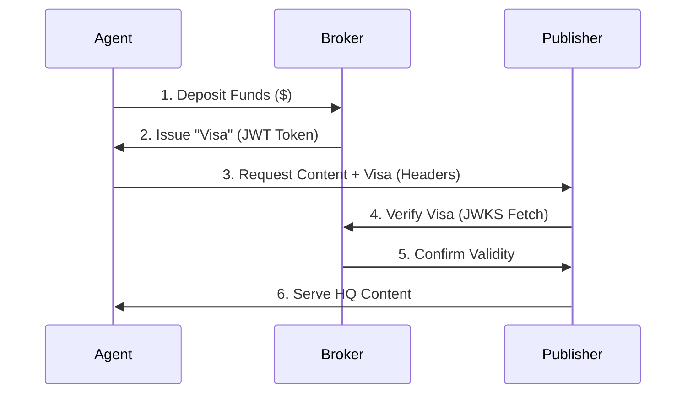

# 🏗️ AAMP System Architecture

This document describes the high-level architecture of the **Identity Monetization Auto Governance Exchange Protocol (IMAGXP)**.

## 1. Top-Level Taxonomy

The system is composed of three distinct participants:

1.  **Agent (The Consumer)**: A machine attempting to read content.
2.  **Publisher (The Provider)**: A web server hosting content.
3.  **Broker (The Clearing House)**: A financial intermediary (Optional in v1.0, Core in v1.1).

---

## 2. Component Design

### 2.1 The Agent Stack
*   **Identity Manager**: Manages Private Keys (`.env`) and rotates them.
*   **IMAGXP Fetcher**: A wrapper around `fetch()` that signs every outgoing request.
*   **Discovery Engine**: Checks `robots.txt` or headers to detect IMAGXP compatibility.

### 2.2 The Publisher Stack (SDK)
*   **Middleware**: Intercepts requests at the Edge (Cloudflare/Vercel).
*   **Policy Engine**: Evaluates requests based on:
    *   **Identity**: Is the signature valid? (Crypto)
    *   **Solvency**: Is the payment valid? (Broker)
    *   **Ethics**: Is the purpose allowed? (Training/RAG)
*   **Logger**: Signing-grade audit trails for dispute resolution.

### 2.3 The Broker Stack
*   **OIDC Provider**: Issues standard OpenID Connect tokens.
*   **Ledger**: An immutable database of transactions (Debits/Credits).
*   **Key Authority**: Hosts the Public Keys (`jwks.json`) used by Publishers to verify tokens.

---

## 3. Security Model

### 3.1 Trust Anchors
*   **DNS**: We rely on HTTPS/DNSSEC to prove that `openai.com` owns the keys at `openai.com/.well-known/...`.
*   **Signatures**: We rely on NIST-standard ECDSA (P-256) for non-repudiation.

### 3.2 Threat Mitigation
*   **Replay Attacks**: Mitigated via `timestamp` + strict 5-minute window.
*   **Spoofing**: Mitigated via Asymmetric Cryptography (Private Key never leaves Agent server).
*   **DDOS**: Mitigated via Edge Caching of Identity Verification results.

---

## 4. Implementation Guidelines
*   **Language Agnostic**: While the reference SDK is TypeScript, the protocol relies only on HTTP/JSON.
*   **Zero-Trust**: Publishers assume all traffic is aggressive until cryptographically proven otherwise.
